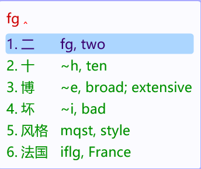

# rime-en-gloss

[](https://github.com/frank-yangfu/rime-en-gloss/releases)
[](LICENSE)
[](#快速开始)
[](#快速开始)
[](#工作原理)
[](docs/quality-review.md)
[](https://github.com/frank-yangfu/rime-en-gloss/stargazers)

> 在 Rime（小狼毫 / 鼠须管 / ibus-rime / fcitx5-rime）的**候选栏里实时显示英文**：输入中文，候选右侧就带上对应的英文释义。



*实机效果：打 `fg`，每条候选右侧是「编码, 英文」；英文在注释槽里，**空格上屏的仍然是中文***

```
┌─────────────────────────────────────────────┐
│ wjjg                                        │
├─────────────────────────────────────────────┤
│ 1. 告诉    wjjg, to tell; to inform         │
│ 2. 东西    aiit, thing; stuff               │
│ 3. 结果    xfjs, result; outcome            │
└─────────────────────────────────────────────┘
```

纯 Lua 过滤器 + 离线词典，**不联网、不用 API key、不依赖任何翻译服务**，打字时零卡顿。

---

## 目录

- [它解决什么问题](#它解决什么问题)
- [特性](#特性)
- [快速开始](#快速开始)
- [工作原理](#工作原理)
- [数据质量：为什么它不会给你错的英文](#数据质量为什么它不会给你错的英文)
- [配置](#配置)
- [可选：长尾词离线补全](#可选长尾词离线补全)
- [项目结构](#项目结构)
- [参与开发](#参与开发)
- [许可与致谢](#许可与致谢)

---

## 它解决什么问题

背单词、看英文文档、跟外国人聊天时，经常想知道「我打的这个词英文怎么说」，但切到翻译软件会打断输入。

rime-en-gloss 把这件事**放进输入法本身**：候选词右边直接给出英文，不切窗口、不联网、不打断思路。

已有的同类方案大多直接调用在线翻译 API（Google / DeepL，需要密钥、大陆多半不通），或者拿词典的第一条释义直接用（`打 → dozen`、`告诉 → to press charges`、`吧 → bar`）。这个项目把重点放在**释义质量**和**不卡输入法**这两件事上。

## 特性

| 特性 | 说明 |
|---|---|
| 注释位显示 | 英文放在 Rime 的 candidate comment 槽（灰色小字），**不影响选词**：空格上屏的永远是中文 |
| 格式统一 | 每行都是 `编码, 英文`；单字没有编码时用你正在输入的编码兜底 |
| 零网络依赖 | 全部数据来自离线词典 CC-CEDICT + 人工校准表，不需要任何账号或密钥 |
| 不卡宿主程序 | 只在缓存未命中时读盘、单次最多解析 4 万行、只处理前 30 个候选、绝不在输入线程里启动进程 |
| 模糊匹配五笔/拼音 | 作为 filter 挂在任意方案上：五笔、拼音、双拼都行 |
| 可离线扩展 | 想要生僻词/长句也有英文，可另跑一个本地小模型服务（可选，非必需） |

## 快速开始

### Windows（小狼毫 Weasel）

```powershell
git clone https://github.com/<你的用户名>/rime-en-gloss.git
cd rime-en-gloss
powershell -ExecutionPolicy Bypass -File scripts\install.ps1
```

脚本会：拷贝 lua 插件 → 下载 CC-CEDICT → 生成 10 万条对照表 → 给方案挂上过滤器 → 重新部署 Rime。
装完切到该方案打字即可（首次连打 3 个字后，整张表就全部载入内存）。

### 手动安装（任意平台）

```bash
# 1) 插件
cp lua/input_text.lua   ~/.config/ibus/rime/lua/          # 路径按你的前端调整
#    小狼毫：%APPDATA%\Rime\lua\     鼠须管：~/Library/Rime/lua/

# 2) 生成词表
cd tools
python fetch_cedict.py                       # 下载并转换 CC-CEDICT（约 200k 条）
python build_cache.py                        # 生成 cache.txt（约 10 万条）
#    Linux 上如果词典不在 ~/.config/ibus/rime，加：
#    python build_cache.py --dict-dir ~/.config/ibus/rime

# 3) 挂到方案：把下面这段存成 <方案名>.custom.yaml，然后重新部署
#    patch:
#      "engine/filters/+":
#        - lua_filter@*input_text*filter
```

`build_cache.py` 只依赖 Python 标准库。输出的词表默认写到 `%TEMP%/rime_argos/cache.txt`（Linux/macOS 同理），可用 `--out` 指定。

> **不想自己构建？** 直接下载 [Releases](https://github.com/frank-yangfu/rime-en-gloss/releases) 里预生成的 `cache.txt`（96,784 条，附 MD5），放进 mailbox 目录即可。
> Linux / macOS 用户建议显式指定 `RIME_EN_GLOSS_DIR`（默认目录在 Linux 下是 `$TMPDIR/rime_argos`，缺省回落 `/tmp/rime_argos`）。

## 工作原理

```
   CC-CEDICT (20万条)          data/overrides_legacy.json
            │                             │
            ▼                             ▼
     ┌──────────────────────────────────────────┐
     │ tools/glossary.py   释义挑选 + 人工校准  │
     │  · 解析 "variant of 繁體" 链             │
     │  · 用 ~420 个最常用英语词给义项打分      │
     │  · 1,500 条单字 / 600 条词组 人工校对    │
     └──────────────────────────────────────────┘
                          │
                          ▼   tools/build_cache.py
              %TEMP%\rime_argos\cache.txt   (96k 条, 2.4 MB)
                          │
                          │  lua 增量读取（每次按键 ≤4 万行）
                          ▼
     ┌──────────────────────────────────────────┐
     │ lua/input_text.lua   candidate filter    │
     │  候选文本 → 查表 → 写入 comment 槽        │
     └──────────────────────────────────────────┘
                          │  未命中
                          ▼
                 request.txt （可选的本地模型服务）
```

**为什么不用网络请求？** 过滤器是**在宿主程序的输入线程里同步执行**的：在微信/Word/浏览器里打字时，lua 里的任何耗时操作都会把整个程序卡住。所以这里只做两件事——查内存表、必要时分段读盘。HTTP、`os.execute`、加载几 MB 的 Lua 字典都会被刻意避开（见 `docs/how-it-works.md`）。

## 数据质量：为什么它不会给你错的英文

直接取 CC-CEDICT 的第一条释义，结果是这样的：

| 词 | 词典第一条 | 本项目的输出 |
|---|---|---|
| 打 | dozen（一打） | to hit; to play |
| 告诉 | to press charges（起诉） | to tell; to inform |
| 东西 | east and west | thing; stuff |
| 结果 | to bear fruit | result; outcome |
| 一次 | first | once; one time |
| 篇 | sheet（床单） | article; chapter |
| 电 | lightning（闪电） | electricity |
| 离 | mythical beast（神话兽） | to leave; apart |
| 刘 | a type of battle-ax | (surname Liu) |
| 潘 | water in which rice has been washed | (surname Pan) |

原因和修法：

1. **多音词条顺序**：CC-CEDICT 按读音分条，常用读音常排在后面 → 用「常用英语词表打分」选最日常的义项。
2. **3,000+ 条 `variant of 繁體` 空壳条目** → 自动跳到本体词条取释义（否则 联系 / 发布 / 这里 会取不到值）。
3. **单字义项偏文言 / 部首** → 逐条人工审查前 1,200 高频字，校准 1,500+ 条（语气词、虚词、姓氏、量词都给说明式释义）。
4. **噪音条目**（部首说明、交叉引用、拉丁学名、截断残句、繁体单字）→ 一律不收录。
5. **专有名词义项抢占** → 同一个词在词典里有多个词条，专有名词那条往往英语更简单（比萨 会变成 "Pisa"，大拇指 变成 "Tom Thumb"，密 变成 "name of an ancient state"）；现在按「大写词数 + 地名/朝代短语」降权，日常义优先。

**刻意不做的事**：不用机器翻译模型生成条目。早期版本用它补词，结果是 `人不 → No, no, no`、`一大 → A big one`、`就能 → Yeah`；这些现在全部被剔除，模型只允许处理 **3 字以上**的词，而且要过一层句式过滤。

详细审查记录见 [`docs/quality-review.md`](docs/quality-review.md)。

## 配置

| 环境变量 | 默认值 | 作用 |
|---|---|---|
| `RIME_EN_GLOSS_DIR` | `%TEMP%\rime_argos` | 词表与请求文件的目录（lua 与服务端共用） |
| `RIME_EN_GLOSS_DEBUG` | 未设置 | 设为 `1` 时把插件诊断写入 `filter_debug.log` |
| `RIME_EN_GLOSS_MODEL` | `tools/models/zh_en` | 可选模型目录 |
| `RIME_EN_GLOSS_CEDICT` | `data/cedict.json` | 词典 JSON 路径 |

`build_cache.py` 常用参数：

```bash
python build_cache.py --cedict data/cedict.json \
                      --out "%TEMP%/rime_argos/cache.txt" \
                      --dict-dir "%APPDATA%/Rime" \
                      --max-len 4
```

`--dict-dir` 指向装有 `wubi86.dict.yaml` / `pinyin_simp.dict.yaml` 的目录：脚本会读取其中的**真实词频权重**来排序，让高频词排在文件前面、更快可用。缺失也不影响正确性。

## 可选：长尾词离线补全

词典没有收录的口语长词（3 字以上）可以交给一个**本地**小模型（CTranslate2 + Argos 中英模型，约 74 MB）翻译，结果会追加到同一张表里。

```bash
pip install ctranslate2 sentencepiece flask
python tools/fetch_mt_model.py          # 下载模型
scripts\start_helper.bat                # Windows：后台启动（无窗口）
python tools/optional_mt_server.py --no-http   # 其他平台
```

不装也完全可用，只是这类长尾词不显示英文。服务全程离线，结果只写进本机文件。

> 该服务设计了心跳文件，但**插件不会主动拉起它**——在输入线程里 `exec()` 会让微信卡住几百毫秒。需要开机自启的话，把 `scripts\start_helper_hidden.vbs` 的快捷方式放进 `shell:startup`。

## 项目结构

```
rime-en-gloss/
├── lua/
│   └── input_text.lua            # 候选英文过滤器（唯一的运行时组件）
├── tools/
│   ├── glossary.py               # 人工校准表 + 释义挑选算法（核心）
│   ├── fetch_cedict.py           # 下载 / 转换 CC-CEDICT
│   ├── build_cache.py            # 生成 cache.txt（纯标准库）
│   ├── optional_mt_server.py     # 可选的本地模型服务
│   └── fetch_mt_model.py         # 下载模型
├── data/
│   └── overrides_legacy.json     # 早期人工校准表（历史积累）
├── schema/
│   └── add_filter.patch.yaml     # 方案补丁示例与说明
├── scripts/
│   ├── install.ps1               # Windows 一键安装
│   ├── start_helper.bat          # 启动可选服务（ASCII 输出）
│   └── start_helper_hidden.vbs   # 无窗口启动可选服务
└── docs/
    ├── how-it-works.md           # 性能与不卡顿的设计取舍
    ├── quality-review.md         # 译义质量审查记录
    └── troubleshooting.md        # 排障
```

## 参与开发

先跑一遍自检，它把审查期间发现过的 bug 都固化成了断言（不需要任何数据文件）：

```bash
python tools/selftest.py
```

CI（`.github/workflows/validate.yml`）会跑：Python 语法、自检、lua 编译、`.bat` 纯 ASCII 检查。

最需要的贡献是**校对译义**：

```python
# tools/glossary.py
SINGLE = {"你": "you", "打": "to hit; to play", ...}   # 单字
WORD   = {"东西": "thing; stuff", ...}                  # 词组
```

改完重跑 `python tools/build_cache.py` 即可生效（无需重新下载词典）。
配错了不怕：`SINGLE` / `WORD` 的优先级最高，直接覆盖词典结果。

其他方向：更多语言的注释（日/韩）、`--target-lang` 参数、把词典换成更权威的词表、Linux 前端（fcitx5）的适配测试。

## 许可与致谢

作者：**Frank**（[@frank-yangfu](https://github.com/frank-yangfu)）

- 本项目代码：MIT（见 `LICENSE`）
- 词典数据：[CC-CEDICT](https://cc-cedict.org/)（CC BY-SA 4.0，MDBG 维护）—— 由 `fetch_cedict.py` 在本地下载，不再分发
- 词频权重：Rime 官方 [rime-wubi](https://github.com/rime/rime-wubi)、[rime-pinyin-simp](https://github.com/rime/rime-pinyin-simp)
- 可选模型：Argos Translate zh→en（MIT）

使用 CC-CEDICT 派生数据时请遵守其 CC BY-SA 4.0 协议。
